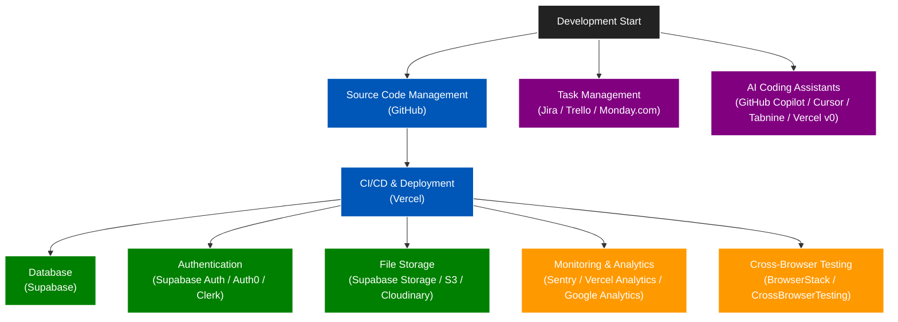

# Comparative Tables of External Services for React App Development

This document compares popular external services for each major category needed in React app development. Each table is focused on a single type of service. Vercel is highlighted as the preferred deployment/hosting option.

---

## Visual Overview: Where Each Service Applies in Development

---

## Source Code Hosting
| Service     | Pros                                                        | Cons                                 | Recommendation     |
|-------------|-------------------------------------------------------------|--------------------------------------|--------------------|
| [GitHub](https://github.com)  | Largest community, GitHub Actions, integrations, private repos | Some advanced features paid           | ⭐ Recommended     |
| [GitLab](https://gitlab.com)      | Self-hosting, built-in CI/CD, private repos                 | UI less popular, slower for OSS      | Good alternative   |
| [Bitbucket](https://bitbucket.org)   | Jira integration, private repos                             | Smaller ecosystem                    | Niche use          |

---

## Deployment/Hosting & CI/CD
| Service      | Pros                                                        | Cons                                         | Recommendation           |
|--------------|-------------------------------------------------------------|----------------------------------------------|--------------------------|
| [Vercel](https://vercel.com)   | Fast, easy, serverless, preview URLs, Git integration, analytics | Limited backend, cold starts, paid for advanced features | ⭐ Best for React/Next.js |
| [Netlify](https://netlify.com)      | Easy, serverless, forms, split testing                      | Limited backend, less optimal for SSR        | Great for static sites   |
| [AWS Amplify](https://aws.amazon.com/amplify/)  | Scalable, many AWS services, auth, analytics                | Complex, AWS pricing, learning curve         | For AWS-centric projects |

---

## Database as a Service
| Service       | Pros                                                        | Cons                                 | Recommendation              |
|---------------|-------------------------------------------------------------|--------------------------------------|-----------------------------|
| [Supabase](https://supabase.com)  | Open source, Postgres, auth, storage, easy to use           | Young ecosystem, some features in beta | ⭐ Modern open-source choice |
| [Firebase](https://firebase.google.com)      | Realtime DB, auth, hosting, analytics                       | No SQL, vendor lock-in, pricing jumps | Good for MVPs/mobile        |
| [PlanetScale](https://planetscale.com)   | Serverless MySQL, branching, scalable                       | No triggers, not Postgres             | For MySQL projects          |

---

## Authentication
| Service      | Pros                                                        | Cons                                         | Recommendation           |
|--------------|-------------------------------------------------------------|----------------------------------------------|--------------------------|
| [Supabase Auth](https://supabase.com/auth) | Integrated with Supabase, easy to use                       | Young, fewer enterprise features             | ⭐ For Supabase projects  |
| [Auth0](https://auth0.com)        | Enterprise-ready, social logins, RBAC                       | Expensive at scale, config complexity        | For enterprise needs     |
| [Clerk](https://clerk.com)        | Modern UI, social logins, user management                   | Newer, paid plans for advanced features      | Good for modern apps     |

---

## Storage
| Service           | Pros                                                        | Cons                                 | Recommendation              |
|-------------------|-------------------------------------------------------------|--------------------------------------|-----------------------------|
| [Supabase Storage](https://supabase.com/storage)  | Easy, integrated with Supabase, public/private buckets      | Young, less mature than S3           | ⭐ For Supabase projects     |
| [S3 (AWS)](https://aws.amazon.com/s3/)          | Scalable, reliable, global                                  | AWS complexity, cost for egress      | For large-scale needs       |
| [Cloudinary](https://cloudinary.com)        | Image/video optimization, CDN, transformations              | Paid for high usage, not general file storage | For media-heavy apps     |

---

## Monitoring & Analytics
| Service           | Pros                                                        | Cons                                 | Recommendation              |
|-------------------|-------------------------------------------------------------|--------------------------------------|-----------------------------|
| [Sentry](https://sentry.io)            | Error tracking, performance, React integration              | Free tier limited, setup required    | ⭐ For error monitoring      |
| [LogRocket](https://logrocket.com)         | Session replay, error tracking, analytics                   | Expensive for scale, privacy concerns| For UX debugging            |
| [Vercel Analytics](https://vercel.com/analytics)  | Easy, privacy-friendly, integrates with Vercel              | Only for Vercel deployments, basic metrics | For Vercel-hosted apps    |
| [Google Analytics](https://analytics.google.com)  | Free, powerful, industry standard                           | Privacy, setup complexity, not real-time | For marketing/traffic     |

---

## Cross-Browser & Visual Testing
| Service               | Pros                                                        | Cons                                 | Recommendation              |
|-----------------------|-------------------------------------------------------------|--------------------------------------|-----------------------------|
| [CrossBrowserTesting](https://crossbrowsertesting.com)   | Real device/browser testing, automation, screenshots        | UI less modern, fewer integrations   | Good for cross-browser QA    |
| [BrowserStack](https://browserstack.com)          | Huge device/browser coverage, integrations, automation      | Expensive at scale                   | ⭐ Most popular, robust      |
| [Sauce Labs](https://saucelabs.com)            | Enterprise features, automation, analytics                  | Complex, expensive                   | For enterprise needs         |

---

## Task Management
| Service      | Pros                                                        | Cons                                         | Recommendation           |
|--------------|-------------------------------------------------------------|----------------------------------------------|--------------------------|
| [Jira](https://www.atlassian.com/software/jira)         | Powerful, highly customizable, integrates with dev tools    | Can be complex, expensive, steep learning curve | ⭐ Best for large teams  |
| [Monday.com](https://monday.com)   | Visual, flexible, automations, good for non-dev teams      | Less dev-focused, can get expensive           | Good for mixed teams     |
| [Trello](https://trello.com)       | Simple, intuitive, fast setup                              | Lacks advanced features for large projects    | Great for small teams    |

---

## Developer AI Assistants & Coding Tools
| Service             | Pros                                                        | Cons                                         | Recommendation           |
|---------------------|-------------------------------------------------------------|----------------------------------------------|--------------------------|
| [GitHub Copilot](https://github.com/features/copilot)      | Deep VSCode integration, strong code suggestions, context-aware | Paid, requires GitHub account, privacy concerns | ⭐ Best for most devs     |
| [Cursor](https://www.cursor.so) (AI Pair)    | Chat-based, codebase-aware, can edit code, context-rich     | Newer, may require setup, paid                | Great for code navigation |
| [Amazon CodeWhisperer](https://aws.amazon.com/codewhisperer/) | AWS integration, supports multiple languages                | Less context-aware, best for AWS users        | For AWS-centric teams     |
| [Tabnine](https://www.tabnine.com)             | Fast, supports many editors, on-prem available              | Suggestions less advanced than Copilot        | Good for privacy-focused  |
| [Vercel v0](https://v0.dev)             | UI generation, integrates with Vercel, fast prototyping     | Newer, limited to UI/codegen, may require Vercel | Great for rapid UI prototyping |

---

## Recommendations

- **Source Code Hosting:** GitHub is the standard for most teams, with great integrations and a robust paid offering. For small teams, GitHub is also the easiest and most cost-effective option.
- **CI/CD & Deployment:** Vercel is highly recommended for React (and especially Next.js) apps due to its seamless integration, preview deployments, and developer experience. For small projects, Vercel's simplicity and automatic previews are ideal.
- **Database:** Supabase offers a modern, open-source Postgres solution with built-in auth and storage. It's especially easy and cost-effective for small projects.
- **Authentication:** Supabase Auth is easy if you use Supabase; Auth0 and Clerk are good for more advanced needs. For small apps, Supabase Auth is the simplest choice.
- **Storage:** Supabase Storage is recommended for most apps using Supabase; S3 is best for large-scale or enterprise needs. For small projects, Supabase Storage is the easiest to set up.
- **Monitoring & Analytics:** Sentry is highly recommended for error monitoring. Use Vercel Analytics for simple, privacy-friendly metrics if deploying on Vercel. Google Analytics is best for marketing and traffic analysis. For small projects, Sentry's free tier is usually sufficient.
- **Cross-Browser Testing:** BrowserStack is the most robust and popular choice, but CrossBrowserTesting is a solid alternative for manual and automated cross-browser QA, especially for small teams.
- **Task Management:** Jira is best for large or dev-heavy teams, Monday.com is great for mixed or business-oriented teams, and Trello is ideal for small or fast-moving teams.
- **Developer AI Assistants & Coding Tools:** GitHub Copilot is the best all-around choice for most developers. Cursor is excellent for codebase navigation and chat-based help. Tabnine is a good privacy-focused alternative.

**Summary:**
> For this project, a stack of GitHub + Vercel + Supabase (DB/Auth/Storage) + Sentry + CrossBrowserTesting + Trello + GitHub Copilot (or Cursor) offers a simple, low-friction, and scalable foundation.

**Overall, for a modern React app, a stack of GitHub + Vercel + Supabase + Sentry + BrowserStack (or CrossBrowserTesting) + Jira (or Monday.com/Trello) + GitHub Copilot (or Cursor/Tabnine) is a robust, developer-friendly, and scalable choice.** 